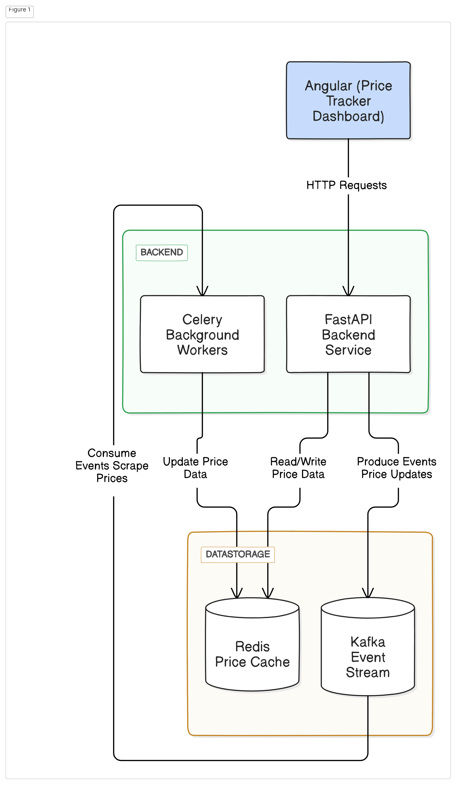

# Real-time Price Tracker

## Overview

The Real-time Price Tracker is a powerful application that allows users to track and monitor price changes from various websites in real-time. Built with a robust tech stack including FastAPI, Angular, Redis, Kafka, and Celery, this project aims to provide accurate and timely updates on price fluctuations, benefiting shoppers, retailers, and analysts alike.

## Table of Contents
- [Features](#features)
- [Tech Stack](#tech-stack)
- [System Architecture](#system-architecture)
- [Installation](#installation)
- [Usage](#usage)
- [API Documentation](#api-documentation)
- [Contributing](#contributing)
- [License](#license)

## Features
- **User Registration and Authentication:** Secure sign-up and login using OAuth2.
- **Add Items for Tracking:** Easily add items for price monitoring by providing a URL.
- **Real-time Price Scraping:** Fetch and update prices in real-time.
- **Notifications:** Get alerts when prices drop below a specified threshold.
- **Dashboard:** Manage tracked items and view historical price trends.
- **Scalability:** Handle up to 100,000 concurrent price tracking requests.

## Tech Stack
- **Frontend:** Angular
- **Backend:** FastAPI
- **Data Storage:** Redis
- **Message Broker:** Kafka
- **Task Queue:** Celery
- **Others:** Docker, Kubernetes for containerization and orchestration.

## System Architecture



The system is designed to handle high loads and provide real-time updates:
- **Angular:** For a dynamic, single-page application experience.
- **FastAPI:** For high-performance, asynchronous handling of HTTP requests.
- **Redis:** For caching and real-time data updates.
- **Kafka:** For handling real-time data streams and event-driven architecture.
- **Celery:** For background task processing and scheduling.

## Installation
### Prerequisites
- Docker and Docker Compose
- Node.js and npm
- Python 3.8+
- Redis
- Kafka

### Steps
1. **Clone the Repository:**
   ```bash
   git clone https://github.com/faisal-fida/realtime-price-tracker.git
   cd realtime-price-tracker
   ```

2. **Set Up Backend:**
   ```bash
   cd backend
   python -m venv venv
   source venv/bin/activate
   pip install -r requirements.txt
   ```

3. **Set Up Frontend:**
   ```bash
   cd ../frontend
   npm install
   npm run build
   ```

4. **Run Docker Containers:**
   ```bash
   cd ..
   docker-compose up --build
   ```

## Usage
### Starting the Application
1. Ensure Redis and Kafka are running.
2. Start the FastAPI backend:
   ```bash
   cd backend
   uvicorn main:app --reload
   ```
3. Start the Angular frontend:
   ```bash
   cd frontend
   npm start
   ```
4. Access the application at `http://localhost:4200`.

### Adding Items for Tracking
- Navigate to the dashboard.
- Enter the URL of the item you want to track.
- Set your desired price threshold for notifications.

### Viewing Price History
- Go to the tracked items section.
- Click on an item to view its historical price trends.

## API Documentation
Detailed API documentation is available and can be accessed via Swagger at `http://localhost:8000/docs` once the backend is running.

## Contributing
We welcome contributions! Please follow these steps:
1. Fork the repository.
2. Create a new branch (`git checkout -b feature-branch`).
3. Commit your changes (`git commit -m 'Add some feature'`).
4. Push to the branch (`git push origin feature-branch`).
5. Open a pull request.

## License
This project is licensed under the MIT License. See the [LICENSE](LICENSE) file for details.

---

Feel free to reach out if you have any questions or need further assistance. Happy tracking!
```